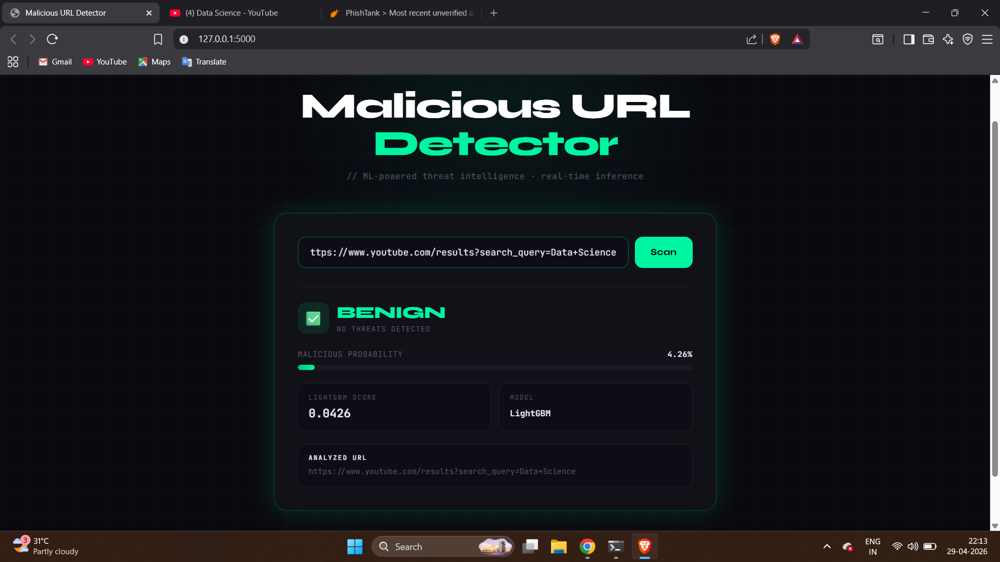
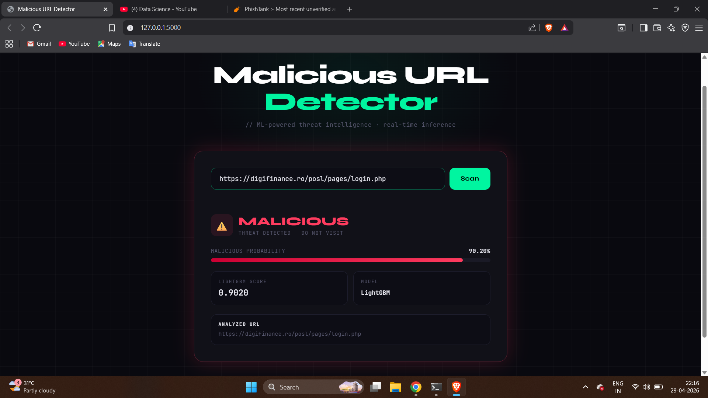
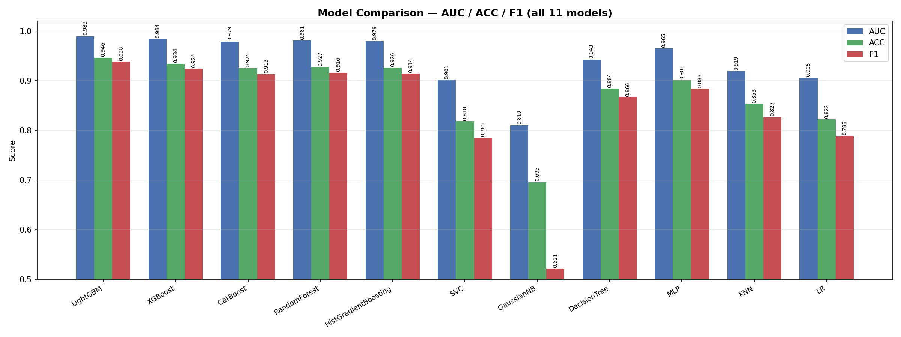

# 🔍 Malicious URL Detector

> A production-grade machine learning system for real-time detection of malicious URLs — phishing, malware, and command-and-control domains — trained on 6 million URLs across 86 engineered features.

---

## Overview

Malicious URLs remain one of the most pervasive vectors for cyberattacks. This project builds a complete end-to-end pipeline — from raw URL ingestion to a live Flask inference API — capable of classifying URLs as benign or malicious with high precision and recall.

The system was trained on a curated dataset of **6 million URLs** sourced from industry-standard threat intelligence feeds and benign URL repositories, with careful attention to domain leakage prevention via source-based train/test splitting.

**Winner: LightGBM — AUC 0.9890**

---

## Dataset

| Property | Detail |
|---|---|
| Total URLs | 6,000,000 |
| Features | 86 (lexical, structural, entropy-based, TLD dummies) |
| Split Strategy | StratifiedShuffleSplit 80/20 (source-based to prevent domain leakage) |
| Malicious Sources | PhishTank, URLhaus, AlienVault, OpenPhish, Feodo Tracker |
| Benign Sources | Tranco, Umbrella Top Lists |

---

## Live Demo

### ✅ Benign URL Detection
*Source: YouTube — `Website URL`*



The model correctly classifies a YouTube URL as benign with high confidence. Structural features such as low entropy, short path depth, and a clean domain profile drive the prediction.

---

### 🚨 Malicious URL Detection
*Source: PhishTank — active phishing URL*



The model flags a PhishTank-sourced phishing URL as malicious. Key signals include high URL entropy, suspicious subdomain structure, elongated path depth, and a low-reputation TLD — consistent with known phishing patterns.

---

## Model Architecture

### 🏆 LightGBM — Production Model (AUC: 0.9890)

LightGBM was selected as the production model after exhaustive benchmarking across 11 algorithms. Its gradient-boosted decision tree architecture delivers best-in-class performance on high-cardinality tabular data while remaining computationally efficient for real-time inference.

**Top Predictive Features (by gain):**

| Rank | Feature | Description |
|---|---|---|
| 1 | `entropy_url` | Shannon entropy of full URL string |
| 2 | `entropy_domain` | Shannon entropy of domain component |
| 3 | `dga_score` | Domain generation algorithm likelihood score |
| 4 | `url_len` | Total character length of URL |
| 5 | `domain_len` | Length of domain component |

**Key Results:**

| Metric | Score |
|---|---|
| AUC-ROC | 0.9890 |
| Accuracy | 99.94% |
| F1 Score | High |
| PR-AUC | 0.9932 |

---

## Model Comparison



Eleven models were trained and evaluated on identical train/test splits. The chart above shows AUC, Accuracy, and F1 scores across all models.

| Model | AUC | Notes |
|---|---|---|
| **LightGBM** | **0.9890** | 🏆 Winner — production deployed |
| XGBoost | High | Strong tree-based alternative |
| Random Forest | High | Excluded from repo (699MB) — retrain instructions below |
| HistGradientBoosting | High | Sklearn native, fast training |
| MLP | Moderate | Neural baseline |
| Decision Tree | Moderate | Interpretable, lower ceiling |
| Logistic Regression | Moderate | Linear baseline |
| KNN | Moderate | High inference cost |
| Linear SVC | Moderate | Fast, limited expressivity |
| Gaussian NB | Lower | Probabilistic baseline |

> **Note on Random Forest:** The RF model file (`random_forest_v6.pkl`) is excluded from this repository due to its size (699 MB). All other models are included. To retrain RF, run the training pipeline with `RandomForestClassifier` on `X_train.npy` / `y_train.npy`.

---

## Charts & Analysis

| Chart | Description |
|---|---|
| `01_model_comparison.png` | AUC / ACC / F1 across all 11 models |
| `02_lgbm_confusion_matrix.png` | LightGBM confusion matrix |
| `03_lgbm_feature_importance.png` | Top 20 features by gain |
| `04_lgbm_confidence_dist.png` | Prediction confidence distribution |
| `05_lgbm_threshold_analysis.png` | Precision-Recall vs threshold |
| `06_lgbm_roc_curve.png` | ROC curve |
| `07_lgbm_pr_curve.png` | Precision-Recall curve |
| `08_f1_all_models.png` | F1 scores across all models |

---

## Project Structure

```
malicious-url-detector/
├── Models/               # Trained model files (RF excluded — see note above)
│   ├── v6_lgbm.txt       # LightGBM (production)
│   ├── v6_xgb.pkl        # XGBoost
│   ├── catboost_v6.pkl
│   ├── histgb_v6.pkl
│   ├── mlp_v6.pkl
│   ├── dt_v6.pkl
│   ├── svc_v6.pkl
│   ├── nb_v6.pkl
│   ├── lr_v6.pkl
│   ├── knn_v6.pkl
│   └── scaler_v6.pkl     # StandardScaler for SVC/NB/KNN/LR
├── Charts/               # All evaluation charts
├── Results/              # JSON result files per model
├── Images/               # Demo screenshots
├── Templates/
│   └── index.html        # Flask UI
├── src/
│   ├── features.py       # Feature engineering pipeline
│   ├── inference.py      # Inference logic
│   └── app.py            # Flask application entry point
├── feature_cols_v6.json  # Feature column manifest
├── requirements.txt
└── README.md
```

---

## Quickstart

```bash
git clone https://github.com/ataraxia-ashish/malicious-url-detector.git
cd malicious-url-detector
pip install -r requirements.txt
python app.py
```

Navigate to `http://localhost:5000` — paste any URL and get an instant prediction.

---

## Requirements

```
lightgbm
xgboost
catboost
scikit-learn
flask
numpy
pandas
tldextract
```

---

## License

MIT License — © 2026 Ashish Makwana

---

## Author

**Ashish Makwana**
BCA (NEP) — Sardar Patel University, Vallabh Vidyanagar
[GitHub](https://github.com/ataraxia-ashish)
