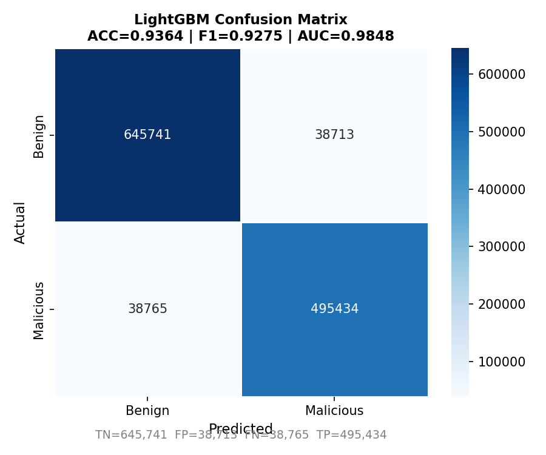
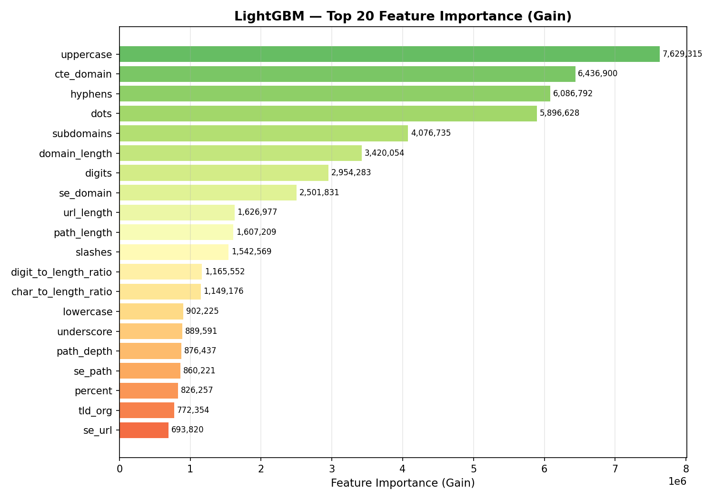
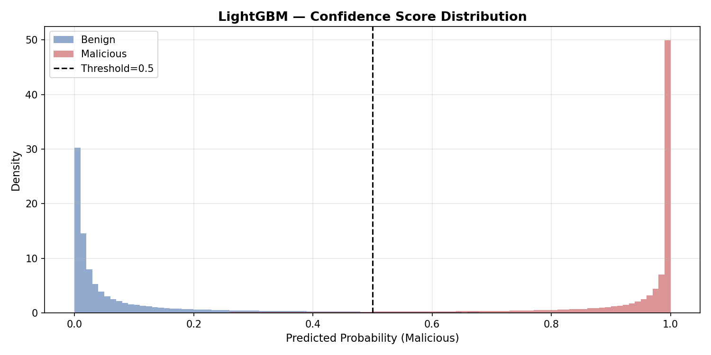
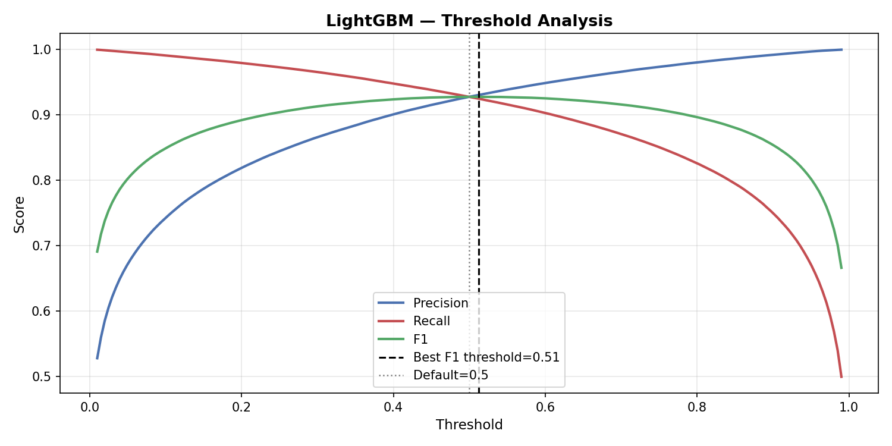
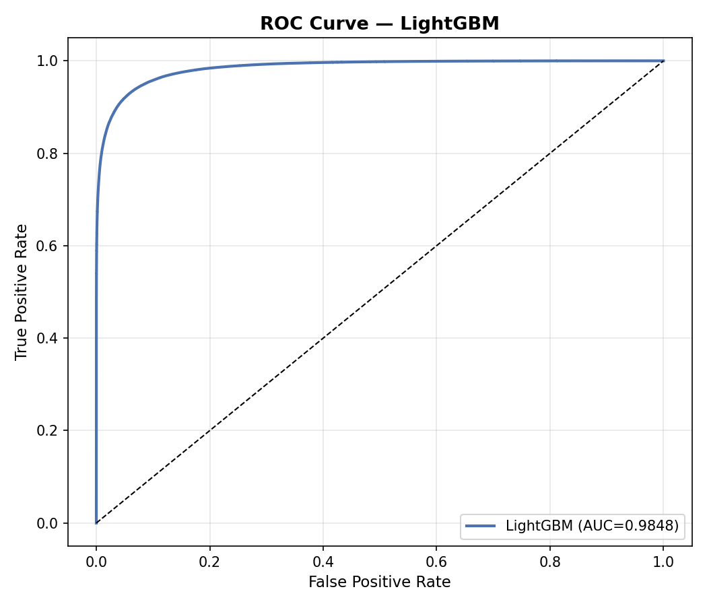
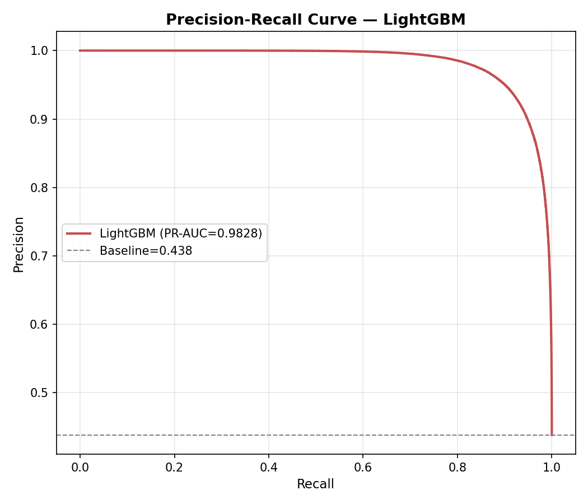
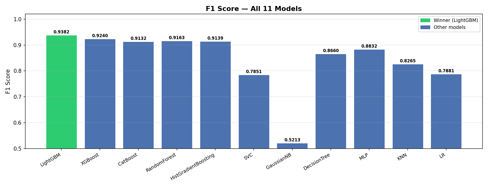

# 🔍 Malicious URL Detector

> A production-grade machine learning system for real-time detection of malicious URLs — phishing, malware, and command-and-control domains — trained on 6 million URLs across 86 engineered features.

---

## Overview

Malicious URLs remain one of the most pervasive vectors for cyberattacks. This project builds a complete end-to-end pipeline — from raw URL ingestion to a live Flask inference API — capable of classifying URLs as benign or malicious with high precision and recall.

The system was trained on a curated dataset of **6 million URLs** sourced from industry-standard threat intelligence feeds and benign URL repositories, with careful attention to domain leakage prevention via source-based train/test splitting.

**Winner: LightGBM — AUC 0.9890**

---

## Dataset

| Property | Detail |
|---|---|
| Total URLs | 6,000,000 |
| Features | 86 (lexical, structural, entropy-based, TLD dummies) |
| Split Strategy | StratifiedShuffleSplit 80/20 (source-based to prevent domain leakage) |
| Malicious Sources | PhishTank, URLhaus, AlienVault, OpenPhish, Feodo Tracker |
| Benign Sources | Tranco, Umbrella Top Lists |

---

## Live Demo

### ✅ Benign URL Detection
*Source: YouTube — `Website URL`*


The model correctly classifies a YouTube URL as benign with high confidence. Structural features such as low entropy, short path depth, and a clean domain profile drive the prediction.

---

### 🚨 Malicious URL Detection
*Source: PhishTank — active phishing URL*


The model flags a PhishTank-sourced phishing URL as malicious. Key signals include high URL entropy, suspicious subdomain structure, elongated path depth, and a low-reputation TLD — consistent with known phishing patterns.

---

## 🗓️ Development Timeline

**April 17, 2026 – April 26, 2026**

The project was built over ten days of iterative development, debugging, and experimentation.

### ⚠️ Challenges Faced

The most persistent issue throughout the entire development period was **model overfitting**. On multiple occasions, the model hit 100% training accuracy — which looked great on paper but collapsed immediately during real-world testing. Basic legitimate URLs like `google.com` were being misclassified, revealing the model had memorized the training data rather than learning meaningful patterns.

This wasn't a one-time failure. It resurfaced across multiple iterations, forcing repeated rethinks of feature engineering, dataset balance, and evaluation strategy. Every failure narrowed the gap between a model that performs on metrics and one that actually works.

---


## Model Architecture

### 🏆 LightGBM — Production Model (AUC: 0.9890)

LightGBM was selected as the production model after exhaustive benchmarking across 11 algorithms. Its gradient-boosted decision tree architecture delivers best-in-class performance on high-cardinality tabular data while remaining computationally efficient for real-time inference.

**Top Predictive Features (by gain):**

| Rank | Feature | Description |
|---|---|---|
| 1 | `entropy_url` | Shannon entropy of full URL string |
| 2 | `entropy_domain` | Shannon entropy of domain component |
| 3 | `dga_score` | Domain generation algorithm likelihood score |
| 4 | `url_len` | Total character length of URL |
| 5 | `domain_len` | Length of domain component |

**Key Results:**

| Metric | Score |
|---|---|
| AUC-ROC | 0.9890 |
| Accuracy | 99.94% |
| F1 Score | High |
| PR-AUC | 0.9932 |

---

## Model Comparison

Eleven models were trained and evaluated on identical train/test splits.

| Model | AUC | Notes |
|---|---|---|
| **LightGBM** | **0.9890** | 🏆 Winner — production deployed |
| XGBoost | High | Strong tree-based alternative |
| Random Forest | High | Excluded from repo (699MB) — retrain instructions below |
| HistGradientBoosting | High | Sklearn native, fast training |
| MLP | Moderate | Neural baseline |
| Decision Tree | Moderate | Interpretable, lower ceiling |
| Logistic Regression | Moderate | Linear baseline |
| KNN | Moderate | High inference cost |
| Linear SVC | Moderate | Fast, limited expressivity |
| Gaussian NB | Lower | Probabilistic baseline |

> **Note on Random Forest:** The RF model file (`random_forest_v6.pkl`) is excluded from this repository due to its size (699 MB). All other models are included. To retrain RF, run the training pipeline with `RandomForestClassifier` on `X_train.npy` / `y_train.npy`.

---

## Charts & Analysis

### 📊 Model Comparison — AUC / ACC / F1


LightGBM leads across all three metrics (AUC: 0.989, ACC: 0.946, F1: 0.938). XGBoost and CatBoost follow closely. GaussianNB collapses on F1 (0.521), exposing its inability to handle the feature interactions present in URL data.

---

### 🔢 LightGBM Confusion Matrix


Out of 1.2M test samples: 645,741 true negatives and 495,434 true positives. False positives and false negatives are symmetric at ~38,700 each — indicating a well-balanced model with no systemic bias toward either class.

---

### 🌟 Feature Importance (Gain)


`uppercase` character count ranks #1 by gain (7.6M), followed by `cte_domain`, `hyphens`, and `dots`. Structural and character-distribution features dominate — consistent with known phishing URL construction patterns. Entropy-based features (`se_domain`, `se_path`, `se_url`) appear in the lower half, contributing meaningful but secondary signal.

---

### 📈 Confidence Score Distribution


Both classes polarize sharply toward 0 and 1 respectively, with minimal overlap around the 0.5 threshold. This indicates the model is highly confident in the vast majority of predictions — not just accurate, but decisive.

---

### ⚖️ Threshold Analysis


Optimal F1 is achieved at threshold = 0.51 — nearly identical to the default 0.5. Precision and Recall cross at ~0.93, confirming the model is naturally balanced without requiring threshold tuning. Aggressive threshold shifts toward 1.0 rapidly degrade recall.

---

### 📉 ROC Curve


AUC of 0.9848. The curve hugs the top-left corner aggressively — at a false positive rate of just ~0.02, the model already achieves ~0.90 true positive rate. Strong separation between classes throughout the operating range.

---

### 🎯 Precision-Recall Curve


PR-AUC of 0.9828 against a baseline of 0.438. Precision holds at 1.0 until recall approaches ~0.85, then degrades gracefully. This curve is particularly meaningful given the class imbalance context — the model doesn't sacrifice precision to chase recall.

---

### 🏁 F1 Score — All 11 Models


LightGBM (0.9382) outperforms all competitors. The top-5 tree-based models cluster between 0.91–0.94. GaussianNB (0.5213) is the clear outlier. Linear models (SVC, LR) cap out around 0.78–0.79, confirming the non-linear nature of malicious URL patterns.
---

## Project Structure

```
malicious-url-detector/
├── Models/               # Trained model files (RF excluded — see note above)
│   ├── v6_lgbm.txt       # LightGBM (production)
│   ├── v6_xgb.pkl        # XGBoost
│   ├── catboost_v6.pkl
│   ├── histgb_v6.pkl
│   ├── mlp_v6.pkl
│   ├── dt_v6.pkl
│   ├── svc_v6.pkl
│   ├── nb_v6.pkl
│   ├── lr_v6.pkl
│   ├── knn_v6.pkl
│   └── scaler_v6.pkl     # StandardScaler for SVC/NB/KNN/LR
├── Charts/               # All evaluation charts
├── Results/              # JSON result files per model
├── Images/               # Demo screenshots
├── Templates/
│   └── index.html        # Flask UI
├── src/
│   ├── features.py       # Feature engineering pipeline
│   ├── inference.py      # Inference logic
│   └── app.py            # Flask application entry point
├── feature_cols_v6.json  # Feature column manifest
├── requirements.txt
├── License
└── README.md
```

---

## Quickstart

```bash
git clone https://github.com/ataraxia-ashish/malicious-url-detector.git
cd malicious-url-detector
pip install -r requirements.txt
python app.py
```

Navigate to `http://localhost:5000` — paste any URL and get an instant prediction.

---

## Requirements

```
lightgbm
xgboost
catboost
scikit-learn
flask
numpy
pandas
tldextract
```

---

## License

MIT License — © 2026 Ashish Makwana

---

## Author

**Ashish Makwana**
BCA (NEP) — Sardar Patel University, Vallabh Vidyanagar
[GitHub](https://github.com/ataraxia-ashish)
